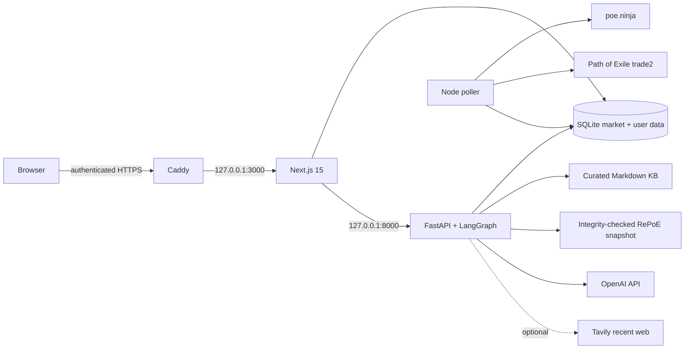

# PoE2 Flip Assistant

PoE2 Flip Assistant helps endgame Path of Exile 2 players decide whether to investigate a
market flip, a curated craft, or a farming basket. It combines observed market data, manual
trade comparables, deterministic item inspection, and an evidence-linked read-only Coach.
It never buys, sells, whispers, clicks, or controls the game.

> Screenshot intentionally omitted from the release candidate until a sanitized demo account is
> available. Do not publish screenshots containing Settings, account names, stash tabs, whispers,
> cookies, net worth, or credentials.

## Product

- **Currency Exchange:** reference converter, observed market history, risk-adjusted flip
  heuristics, alerts, and manual position tracking.
- **Web Market:** poe2scout demand signals plus read-only trade2 hunting.
- **Craft:** fourteen curated recipes with observed comparables, modelled EV, interactive steps,
  and manual attempt/P&L tracking.
- **Wealth:** opt-in read-only valuation of a user's public stash tabs.
- **Coach:** authenticated LangGraph sidecar with market, knowledge, game-data, and optional
  recent-web tools. Every answer exposes tool/source evidence and a human-verification boundary.

## Architecture



Caddy is the only public listener. Next and Coach bind to loopback. User-specific POESESSID
values are encrypted at rest; the Coach receives no product decryption key and its tools never
query credential columns.

## Data boundaries

| Source | Use | Important limitation |
|---|---|---|
| poe.ninja | Reference mids, volume, history | Aggregated observation; not executable bid/ask. |
| trade2 | Listings and craft comparables | An ask can disappear and is not a guaranteed sale. |
| poe2scout | Unique-item market flow | Aggregated signal, not a live listing. |
| SQLite snapshots | Historical trends | Observed history; legacy `chaos_equiv` values are Divine. |
| Curated KB | Stable mechanics and warnings | Patch-sensitive; confidence labels must be preserved. |
| RePoE 4.5.4.7 | Bases, modifiers, tiers and item descriptions | Compatibility data, not exact crafting probabilities. |
| Tavily | Recent public-web evidence | Optional and lower authority than primary/game data. |

Top Flip is a heuristic, FarmAdvisor is basket heat rather than Div/hour, and Craft EV uses a
curated hit rate plus observed asks. Players must verify item state and prices in-game.

## Local setup

Requirements: Node.js 20.18.1+, npm, SQLite, and `uv`. Copy the web/poller template to `.env.local`
and the isolated Coach template to a private local path. Never commit or print either file.

```bash
npm ci
uv --cache-dir services/coach/.uv-cache --directory services/coach sync --locked
npm run db:migrate
# Set COACH_ENV_FILE to the private Coach env path in this shell, then:
npm run dev
```

Refresh committed deterministic game data only as an intentional feature update:

```bash
npm run sync:poe2-data
npm run verify:poe2-data
```

## Verification

```bash
npm run lint
npm run typecheck
npm run test:coach
npm run test:middleware
npm run test:demo-user
npm run build
COACH_DISABLE_DOTENV=1 uv --cache-dir services/coach/.uv-cache --directory services/coach run pytest
```

Additional domain tests are exposed in `package.json`. Product smoke tests and the separate
certification benchmark are different artifacts: the public certification eval repository is
[poe2-flip-coach-certification](https://github.com/RysanekDavid/poe2-flip-coach-certification).
Its frozen results must not be presented as an evaluation of this integrated product.

## Deployment and Demo Day

Production uses an atomic release directory, a `current` symlink, systemd, and Caddy Automatic
HTTPS configured by `SITE_ADDRESS`. `deploy.sh` publishes the target commit as a short
non-sensitive build ID and verifies it after switching. See [deploy/README.md](deploy/README.md)
and [docs/demo-day-runbook.md](docs/demo-day-runbook.md).

Demo flow: **Currency Exchange → Top Flip + chart → FarmAdvisor → Boots · putrefaction ES
(caster) → Coach**. No Settings page or automated trade action is needed.

## Security boundary

- Authentication is mandatory for product pages and APIs.
- The Coach is read-only, receives no product decryption key, and never exposes POESESSID.
- Only Caddy exposes ports 80/443; ports 3000/8000 stay private.
- No full production database or secret-bearing transcript belongs in a public artifact.
- Human review is mandatory before every trade or craft currency action.
